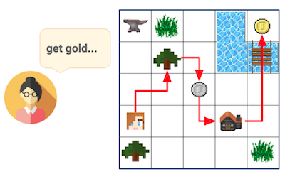
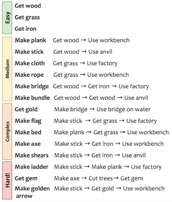
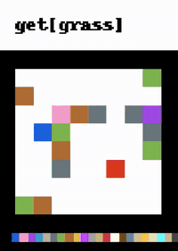

# Craft Environment

CraftEnv is a 2D crafting environment, adapted and extended from Andreas et al.,[[1]](##References).

It supports a fully flexible setup of hierarchical tasks, with sparse rewards, in a fully procedural setting.

In this environment, an agent has to:

* Move around
* Pick up items and keeping them in an inventory
* Transform things at workshops

Tasks are quite varied, and requires the agent to pick up components and create various items.
Here is an example of what is required to perform the task **pick up gold** (see Figure below):

1. Get wood
1. Make plank:  Get wood → Use workbench
1. Make bridge: Get wood → Get iron → Use factory
1. Get gold: Make bridge → Use bridge on water

<p>
 <br />
<b> Crafting environment example for a complex multi-step task.</b> <br/>
When provided with a "get gold" task by the Teacher, the agent needs to first collect wood, transform it at a workshop to construct a bridge, in order to finally pass across the water and reach the gold.
</p>

This kind of multi-step action sequences can be really hard to learn, given that agents usually only performs random exploration.

In total, I have extended the environment and defined a collection of 17 tasks, ranging from simple "collection" tasks to more complex ones that requires crafting several items to succeed.
See the next Figure for a complex list, along with an indication of their difficulty.
<p>
 <br />
<b>Full list of tasks considered in our crafting environment. </b><br/>
Tasks range from simple collection "Get X" tasks, slightly more difficult crafting tasks (requiring to collect items before), all the way to complex tasks requiring several crafted components which depend themselves on sub-tasks.
</p>

I wrote a visualisation tool to see how these environments look like and how agents interact with it.
This is currently only used for post-hoc analysis or debugging, as the agent instead receives a set of features as observation.
But in future work, one could instead use this 2D view as observation for agents.

<p>
 <br />
<b> Visualisation of a random agent trying to solve the "Get grass" task. </b><br/>
The instruction is shown at the top, the 2D grid in the middle and the inventory is shown at the bottom. Each color correspond to a different object or workshop, the player is the red dot. When the player picks up a green square (grass), the screen flashes to indicate a positive reward.
</p>


## Usage:

To visualise random agent, run with:

```sh
python random_agent.py
```

## Dependencies:

- [Python 2.7](https://www.python.org/)
- [NumPy](http://www.numpy.org/)
- [scikit-image](https://scikit-image.org/)
- [Pillow](https://pypi.org/project/Pillow/)
- [seaborn](https://seaborn.pydata.org/)
- [Curses](https://docs.python.org/2/howto/curses.html)
- [yaml](https://pyyaml.org/wiki/PyYAMLDocumentation)

## Note:

This code should also be able to integrate with Gym environments with minor changes, which will be added soon. Currently the wrapper for the Craft Env mimics [DMLab](https://github.com/deepmind/lab) interface.

## Acknowledgements

- [@jacobandreas](https://github.com/jacobandreas) for open-sourcing the mine-craft inspired Craft Environment used in Policy Sketches paper [[1]](##References) [Craft Environment](https://github.com/jacobandreas/psketch) which this codebase is heavily based on

## References

* [1] [Modular Multitask Reinforcement Learning with Policy Sketches](https://arxiv.org/abs/1611.01796) (Andreas et al., 2016)
